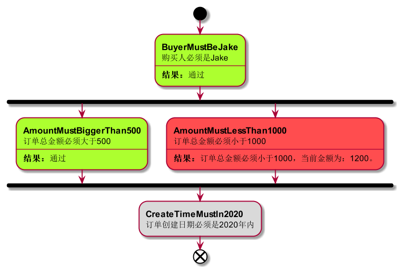

***

<div align="center">
    <b><em>Simple Rule</em></b><br>
    一个简单易用的规则验证库。
</div>

<div align="center">

[](http://opensource.org/licenses/MIT)

</div>

***

## What is Simple Rule?

在日常业务开发中，我们常常需要对业务实体进行规则校验。举个例子，在采购系统中，当创建一个新的采购订单时，我们需要对该订单进行以下验证：
* 采购人必须拥有采购权限。
* 采购总金额不能超过10000元。
* 采购商品必须是允许采购的。
* 采购商品种类不能超过10个。
* 采购商品数量不能超过100个。
* ……

同时，在不同的业务流程中，这些检查规则可能需要复用。

针对这种场景，我们自然希望把每个业务规则抽象为一个类，每个类实例代表一条业务规则。然后，对这些规则实例进行**组合**，最终得到完整的业务规则集。另外，当一个业务规则集变得非常复杂时，如果能够**可视化**地展示检查流程和检查结果，那么对于产品的用户体验和可维护性有非常大的帮助。

基于上述想法，我编写了Simple Rule这个库。

## Core Features

* 一个规则对应一个类，符合“高内聚、低耦合”的原则。
* 提供多种组合方式，满足各种规则组合需求。
* 支持并行检查，提高检测效率。
* 支持生成检测流程和检查结果的图片。

## Quick Start

### 场景
在订单创建流程中，我们需要对订单执行以下检查：
1. 购买人必须叫“Jake”。
2. 订单总金额必须大于500。
3. 订单总金额必须小于1000。
4. 订单创建日期必须是2020年内。

以上规则需从上至下依次执行，但第2、3条规则可以并行执行。

### 实施
1. 创建订单类：
```java
@AllArgsConstructor
@Getter
public class Order {
    private String buyer;
    private int amount;
    private LocalDateTime createTime;
}
```

2. 通过继承抽类Rule<T>，创建4个规则子类：
```java
@Rule.Descriptor("购买人必须是Jake")
public class BuyerMustBeJake extends Rule<Order> {
    @Override
    public RuleCheckResult check(Order target) {
        if (target.getBuyer().equalsIgnoreCase("Jake")) {
            return this.pass("通过");
        }else {
            return this.error(String.format("购买人必须是Jake，当前购买人：%s。", target.getBuyer()));
        }
    }
}

@Rule.Descriptor("订单总金额必须大于500")
public class AmountMustBiggerThan500 extends Rule<Order> {
    @Override
    public RuleCheckResult check(Order target) {
        if (target.getAmount() > 500) {
            return this.pass("通过");
        } else {
            return this.error(String.format("订单总金额必须大于500，当前金额为：%d。", target.getAmount()));
        }
    }
}

@Rule.Descriptor("订单总金额必须小于1000")
public class AmountMustLessThan1000 extends Rule<Order> {
    @Override
    public RuleCheckResult check(Order target) {
        if (target.getAmount() < 1000) {
            return this.pass();
        } else {
            return this.error(String.format("订单总金额必须小于1000，当前金额为：%d。", target.getAmount()));
        }
    }
}

@Rule.Descriptor("订单创建日期必须是2020年内")
public class CreateTimeMustIn2020 extends Rule<Order> {
    @Override
    public RuleCheckResult check(Order target) {
        if (target.getCreateTime().getYear() == 2020) {
            return this.pass("通过");
        } else {
            return this.error(String.format("订单创建日期必须是2020年内，当前订单创建年份：%d.", target.getCreateTime().getYear()));
        }
    }
}
```

3. 组合规则，进行验证：

```java
    public static void main(String[] args) throws IOException {

        // 1. 创建订单
        Order order = new Order("Jake", 1200, LocalDateTime.of(2019, 1, 1, 0, 0));

        // 2. 通过组合各规则对象，构建订单规则集。
        SerialRuleSet<Order> orderRules = Rule.serial(
                new BuyerMustBeJake(),
                Rule.parallel(
                        new AmountMustBiggerThan500(),
                        new AmountMustLessThan1000()
                ),
                new CreateTimeMustIn2020()
        );

        // 3. 使用订单规则集检查订单，获得检查结果
        RuleCheckResult result = orderRules.check(order);

        // 4. 判断结果中是否有错误
        if (result.hasError()) {
            System.out.println("检查未通过"); // 控制台打印出：检查未通过
        }

        // 5. 导出检查流程图片
        orderRules.drawImageWithResult(result, "images/orderRules.png");
    }
```

其中第5步导出的图片如下所示:


