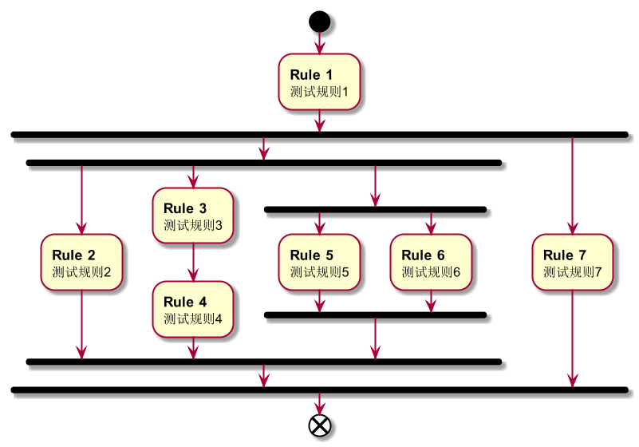
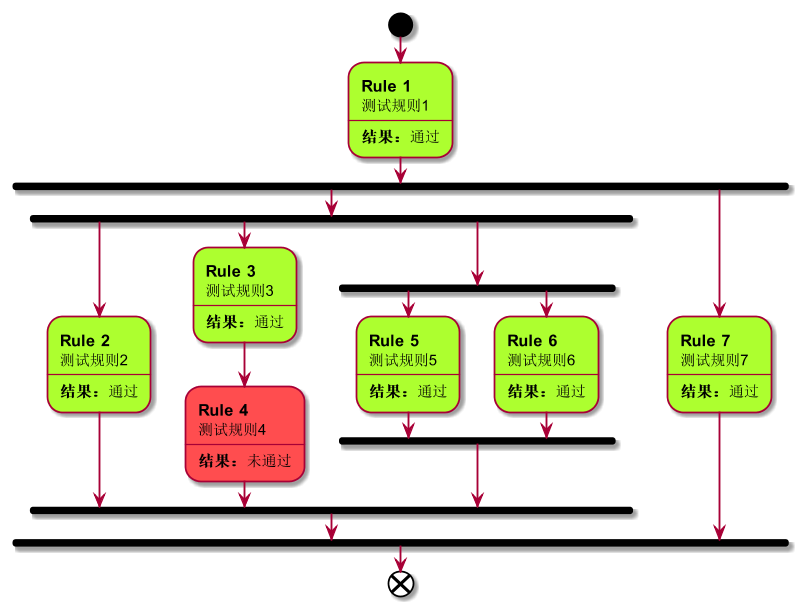

## 流程图

流程图有两种，一种是不带执行结果的，一种是带执行结果的。

不带执行结果的流程图通过调用`drawImage`方法生成：

```java
    // 创建规则集
    SerialRuleSet<String> ruleSet = Rule.serial(
                rule1,
                Rule.parallel(
                        Rule.parallel(rule2,
                                Rule.serial(rule3, rule4),
                                Rule.parallel(rule5, rule6)),
                        rule7
                )
        );
    // 生成流程图
    ruleSet.drawImage("images/不带执行结果的流程图.png");
```

结果如下：



带结果的流程图则需要先得到执行结果，然后再将其作为参数调用`drawImageWithResult`：

```java
    rule4.setPassStr("Don't Pass"); // 让Rule4检查不通过，其他规则都可检查通过
    SerialRuleSet<String> ruleSet = Rule.serial(
            rule1,
            Rule.parallel(
                    Rule.parallel(rule2,
                            Rule.serial(rule3, rule4),
                            Rule.parallel(rule5, rule6)),
                    rule7
            )
    );
    RuleCheckResult result = ruleSet.check("pass");
    ruleSet.drawImageWithResult(result, "images/带执行结果的流程图.png");
```

